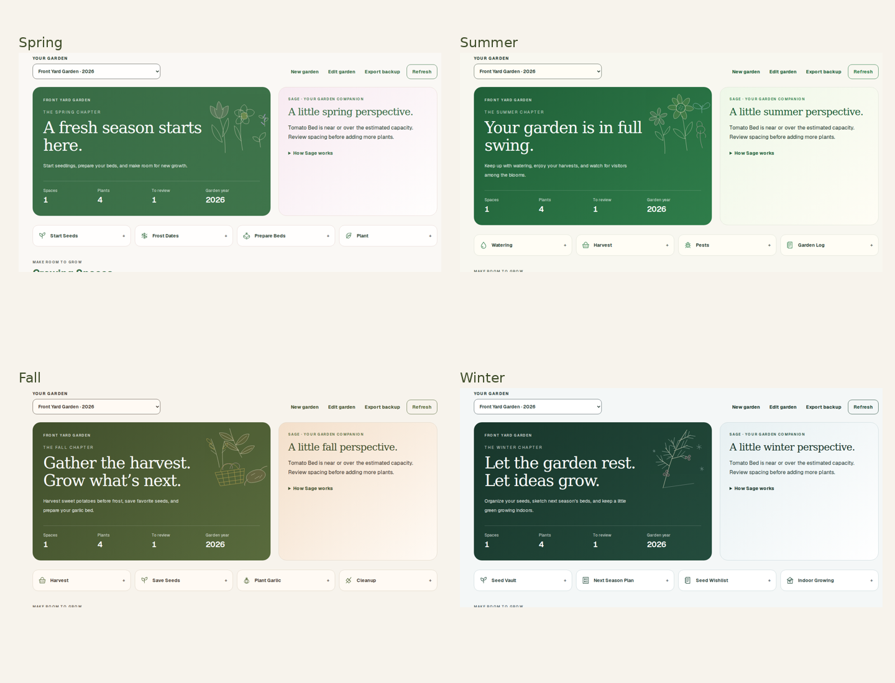
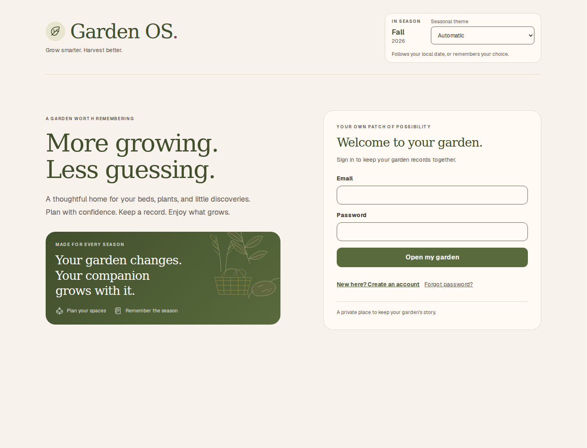

# Seasonal themes

Garden OS keeps the dashboard layout, garden loading, and Supabase garden creation flow. A seasonal theme changes its palette, hero message, small botanical vignette, Sage heading, and four dashboard shortcuts. Shortcuts open accessible gardening checklists; full watering, seed library, and planning modules remain future work.

## Selection and date rules

Choose **Automatic**, **Spring**, **Summer**, **Fall**, or **Winter** in the header. The choice is saved in browser localStorage (`garden-os-season`) and synced across tabs. Invalid values fall back to Automatic. If storage is blocked, selection still works for the current page session.

Automatic uses the viewer's local date and Northern Hemisphere meteorological seasons:

| Season | Months | Shortcuts |
| --- | --- | --- |
| Spring | March–May | Start Seeds, Frost Dates, Prepare Beds, Plant |
| Summer | June–August | Watering, Harvest, Pests, Garden Log |
| Fall | September–November | Harvest, Save Seeds, Plant Garlic, Cleanup |
| Winter | December–February | Seed Vault, Next Season Plan, Seed Wishlist, Indoor Growing |

The provider rechecks the date every minute and on focus/visibility changes. Garden year is independent of theme selection. An early inline script applies the palette before first paint; React uses a matching server snapshot during hydration, then resolves browser-local preferences. Server-rendered text may briefly show the automatic season before hydration restores a manual selection.

## Design

- Stable Garden OS leaf mark, typography, layout, cards, and Supabase form.
- Spring: fresh green, blossom pink, lavender, yellow; tulip, daffodil, seedling.
- Summer: garden green, zinnia pink, sunflower yellow, marigold orange, sky blue; zinnia, cosmos, sunflower, butterfly.
- Fall: olive, rust, gold, plum; autumn leaf, seed heads, harvest basket, sweet potatoes. No pumpkins.
- Winter: evergreen, icy blue, berry, white; evergreen branches, berries, subtle snowflake.
- Small noninteractive SVG decorations, visible form labels, focus outlines, minimum 44px shortcut/selector targets, and reduced-motion support.

## Development and validation

Use Node.js 22.18+ or 24 for the native TypeScript test runner. Install with `npm ci`. Configure `NEXT_PUBLIC_SUPABASE_URL` and `NEXT_PUBLIC_SUPABASE_PUBLISHABLE_KEY` with your existing project values before `npm run build` or `npm run dev`.

Validation performed:

- `npm run test`: all months, month boundaries, leap day, preference validation, exact shortcut sets, sweet-potato Fall content.
- `npm run lint` and `npm run build`: pass.
- Chromium production-build checks: all themes and shortcut disclosures; reload persistence; cross-tab sync; invalid/blocked storage; local seasonal boundaries; 320px, 390px, 768px layouts; zero browser errors.
- Axe accessibility scan: zero WCAG 2 A/AA and WCAG 2.1 AA violations in all four desktop themes.
- Garden load, POST insertion, and reload verified against a local Supabase-compatible fixture. Live Supabase credentials were not available in the checkout; no live database writes were made. The Supabase client and query/insert logic are unchanged.

## Previews

| Season | Desktop | Mobile |
| --- | --- | --- |
| Spring | [Preview](previews/spring-desktop.png) | [Preview](previews/spring-mobile.png) |
| Summer | [Preview](previews/summer-desktop.png) | [Preview](previews/summer-mobile.png) |
| Fall | [Preview](previews/fall-desktop.png) | [Preview](previews/fall-mobile.png) |
| Winter | [Preview](previews/winter-desktop.png) | [Preview](previews/winter-mobile.png) |

## Journal design update

The current preview refines the seasonal artwork into botanical line studies, uses editorial serif headings and consistent line icons, and removes emoji-heavy controls. Dashboard totals now come from saved space/plant records. Sage explains capacity calculations; shortcut checklists remember progress on the current browser. Screenshots above now reflect the journal design and an isolated test garden, rather than live personal data.

The private Supabase setup is documented in [Private Garden Setup](PRIVATE_GARDEN_SETUP.md). All new core flows pass fixture-backed browser checks; live writes require that setup.
